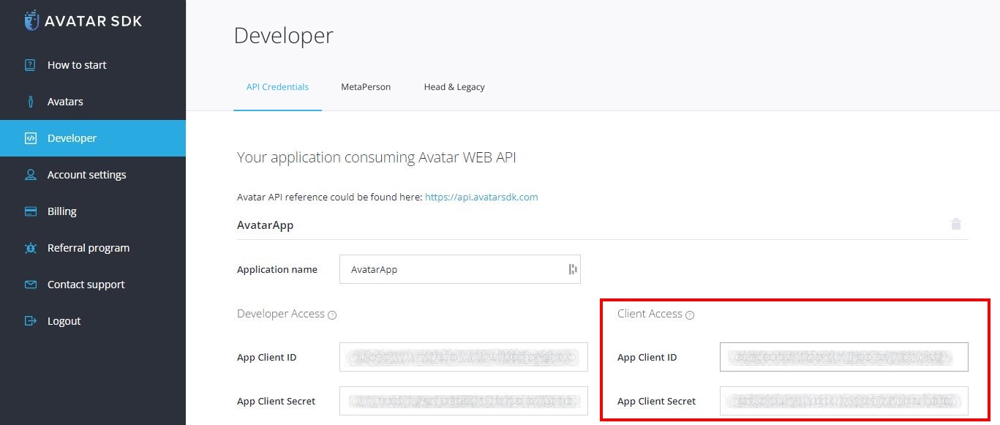
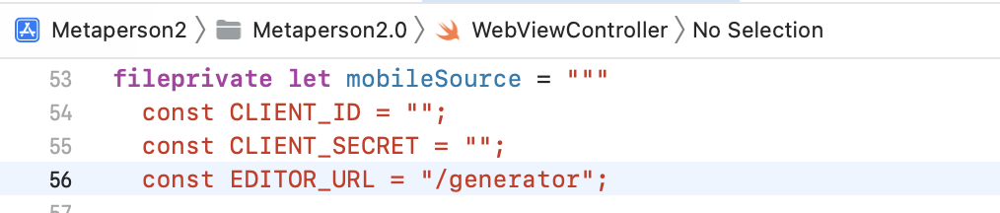

# MetaPerson - iOS Sample
This sample demonstrates how to embed the [MetaPerson Creator](https://metaperson.avatarsdk.com/) website inside a native iOS application using `WKWebview`.

## Getting Started.
You need to complete the following steps before experimenting with this sample:

* Get an AvatarSDK developer account at https://accounts.avatarsdk.com/developer/signup/
* Enter any name in the "Application Name” and press the "Submit" button to get your credentials for using Avatar SDK. https://accounts.avatarsdk.com/developer/
* Copy the `App Client ID` and `App Client Secret` from the Client Access application at https://accounts.avatarsdk.com/developer/


Now you are ready to go:
* Clone this repository to your computer
* Open the workspace in Xcode.
* Open the `Metaperson2.0/AvatarSDKCredentials.swift` file.
* Find the `AvatarSDKCredentials` class and provide `clientID` and `clientSecret`.

* Build and run an iOS application `Metaperson2.0`.

Inside the application:
* Press the `Create avatar` button to show the [MetaPerson Creator](https://metaperson.avatarsdk.com/)
* Create your personal avatar.
* Once you finished an avatar's customization, press the `Export` button to create a download link.
* Once the link is created you can download your avatar.
* Press `Show avatar` to open our fully native 3D viewer based on the SceneKit framework.

## How It Works
### Importing Avatar From Web Page
[MetaPerson Creator](https://metaperson.avatarsdk.com/) page can be shown in a Web View component.
You can use any other Web View component that best suits you.
* Load the following page in a Web View: https://metaperson.avatarsdk.com/iframe.html
* Before the page is loaded this JavaScript code should be executed. It subscribes to some events and posts messages with authentication and export parameters.
```js
const CLIENT_ID = "\(AvatarSDKCredentials.clientID)";
const CLIENT_SECRET = "\(AvatarSDKCredentials.clientSecret)";

document.addEventListener('DOMContentLoaded', function onDocumentReady() {
    window.addEventListener("message", onWindowMessage);
    window.webkit.messageHandlers.iosListener.postMessage(event.data);
});

var iframe = document.querySelector('iframe')
iframe.setAttribute("id", "editor_iframe");
iframe.setAttribute("allow", "fullscreen");

var avatarPreset = document.getElementById('avatar-preset')

function onWindowMessage(evt) {
    if (evt.type === "message") {
        if (evt.data?.source === "metaperson_creator") {
            let data = evt.data;
            let evtName = data?.eventName;
            if (evtName === "mobile_loaded") {
                onMobileLoaded(evt, data);
                window.webkit.messageHandlers.iosListener.postMessage(data);
            } else if (evtName === "model_exported"){
                window.webkit.messageHandlers.iosListener.postMessage(data);
                avatarPreset.innerText = "model url: " + data.url
            }
        }
    }
}

function onMobileLoaded(evt, data) {
    let authenticationMessage = {
        "eventName": "authenticate",
        "clientId": CLIENT_ID,
        "clientSecret": CLIENT_SECRET,
        "exportTemplateCode" : "",
    };
    evt.source.postMessage(authenticationMessage, "*");

    let exportParametersMessage = {
        "eventName": "set_export_parameters",
        "format" : "glb",
        "lod" : 2,
        "textureProfile" : "1K.png"
    };
    evt.source.postMessage(exportParametersMessage, "*");
}
```
* Client credentials and [export parameters](#export-parameters) are specified in the `onMobileLoaded` method.
* `onWindowMessage` method is executed when the [MetaPerson Creator](https://metaperson.avatarsdk.com/) page sends messages.
* When an avatar model is exported, the corresponding `model_exported` event is received with a URL of this model. 
* [Model Loader](#model-loader) is used to load the model by its URL and display it in the scene.

[See more information about JS API](https://docs.metaperson.avatarsdk.com/js_api.html)

Implementation details can be found in the [WebViewController.swift file](./Metaperson2.0/WebViewController.swift).

### Export Parameters
Export parameters allow you to customize the output of the exported avatar by specifying textures resolution, mesh format, and level of detail.
* **format** - specifies the mesh format of the exported avatar. Supported formats: **gltf**, **glb**, **fbx**.
* **lod** - specifies the level of detail (LOD) for the exported avatar mesh. The higher the value, the less detailed mesh. Possible values: **1** and **2**.
* **textureProfile** - specifies the texture profile for the exported avatar (textures resolution and format). Possible values: **4K.png**, **2K.png**, **1K.png**, **4K.jpg**, **2K.jpg**, **1K.jpg**,
**4K.webp**, **2K.webp**, **1K.webp**.

## Model Loader
This sample exports avatars in **glb** format.<br/> 
The exported model URL contains a link to a ZIP archive.<br/>

## Support
If you have any questions or issues with the plugin, please contact us <support@avatarsdk.com>.
